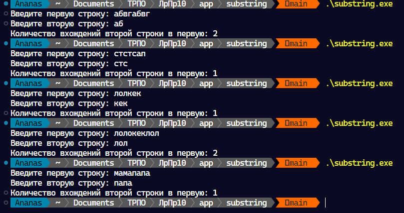

# Substring

Приложение находит число вхождений второй строки впервую

# Как использовать

1. Исполняемый файл

    Запустите файл `substring.exe` и введите 2 строки

2. С помощью Golang

    Запустите файл `substring.go` и введите 2 строки

    Для запуска вы должны установить язык программирования [golang](go.dev) и выполнить команду `go run substring.go`

# Тестирование

| Строка 1      | Строка 2   |  Вывод |
| ----------- | -----------|-----------|
| авбгавбг |  аб  |  2 |
|  стстсап | стс  | 1  |
| лолкек | кек  | 2 |
| мамапапа | папа | 1 |
| опапапаопаопаопаооопаопаопа | опа |  7 |
|||